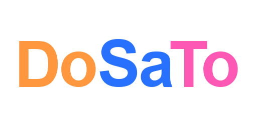

<p align="center">
  
</p>

# CDosato version 0.4.4

CDosato is the official implementation of the DOSATO programming language.<br>

## Table of Contents

- [Introduction](#introduction)
- [Installation](#installation)
- [Usage](#usage)
- [Documentation](#documentation)
- [Contributing](#contributing)
- [License](#license)
- [Contact](#contact)

## Introduction

Dosato is a general purpose interpreted programming language that is designed to be simple and easy to use. It is a dynamically typed language that supports static typing as well.<br>
The language is pretty simple and easy to learn. It is designed to be beginner friendly and is a great language to start with if you are new to programming.<br>


## Installation

In the root directory of the project, run the following command to install the CDosato interpreter:

```bash
make
```

This will create a `dosato` executable in the build directory of the project. You can run the interpreter using the following command:

```bash
./build/dosato -v
```

This will display the version of the interpreter.

## Usage

To run a Dosato program, you can use the following command:

```bash
dosato <path-to-dosato-file>
```

For example, to run the `hello_world.to` program, you can use the following command:

```bash
dosato hello_world.to
```

(You can find the `hello_world.to` program in the tests directory of the project)

## Documentation

I have build a downloadable documentation for Dosato, you can download it [here](https://github.com/Robotnik08/Dosato-docs).<br>
This documentation is also available online [here](https://robotnik08.github.io/Dosato-docs/).<br>

## Contributing

This language is still in its early stages of development, and I (Sebastiaan Heins) mainly work on it in my free time as a hobby project. I personally think Dosato has potential, but we are still a long way from reaching that potential. If you would like to contribute to the project, you are more than welcome to do so. You can contribute by fixing bugs, adding new features, improving the documentation, or even just by giving feedback on the language. Any kind of contribution is appreciated.<br>
I'm not that familiar with the open source community, so I'm not sure how to handle contributions. If you would like to contribute, please reach out. :p

## License

This project is licensed under the MIT License - see the [LICENSE](LICENSE) file for details.

## Contact

Since this language is currently being developed by me alone, you can contact me directly if you have any questions or feedback.
